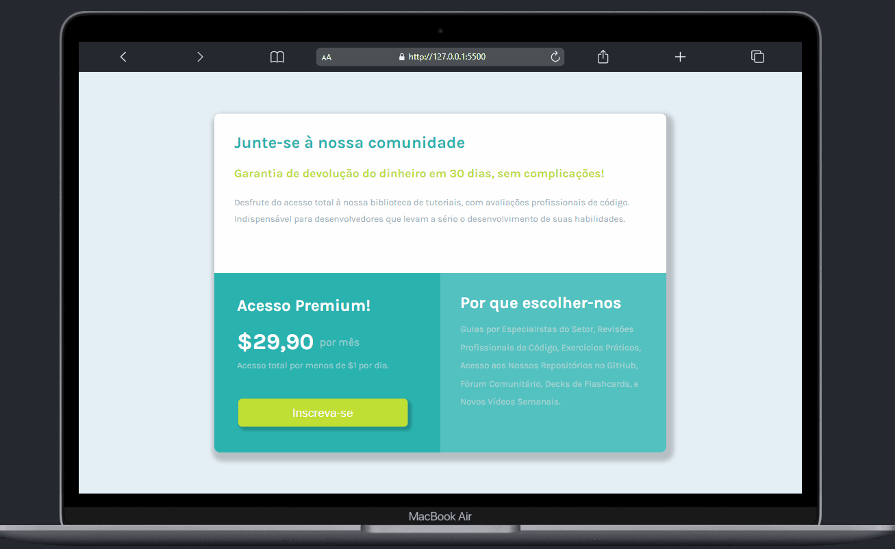
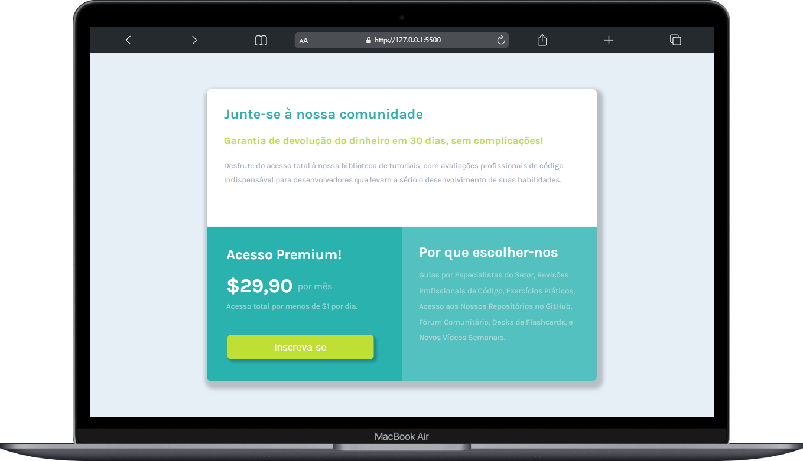
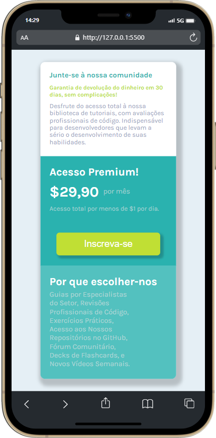

#  Grade de Preço Único - Desafio Frontend Mentor 💻

## Visão Geral 🚀 
Este projeto foi desenvolvido como parte do desafio do Frontend Mentor, visando aprimorar habilidades em HTML e CSS. A proposta é criar uma grade de preço única, utilizando conceitos avançados como flexbox e grid, além de garantir responsividade para proporcionar uma experiência consistente em diferentes dispositivos. 👩‍💻

## Objetivo 🎯
O objetivo principal deste exercício é criar um Grade de Preços Responsiva, demonstrando a capacidade de estruturar o layout usando tanto Flexbox quanto Grid. Isso ajuda a fortalecer as habilidades essenciais para o desenvolvimento de interfaces de usuário atraentes e funcionais. 🎨

### Layout Responsivo 

Adaptação do design para uma experiência de usuário otimizada em dispositivos móveis, tablets e desktops.

### Organização com Flexbox e Grid

Utilização eficiente de flexbox e grid para estruturar e posicionar os elementos na página de maneira moderna e flexível.

### Efeito Hover Interativo

Implementação de efeitos visuais nos botões para melhorar a interatividade e proporcionar feedback visual aos usuários.

## Preview Gif 🎥
Efeito Hover Interativo nos botões para melhorar a interatividade e proporcionar feedback visual aos usuários.

## Preview Desktop 🖥️ 📸
Visualize a Grade de Preços em todo o seu desktop!

## Preview Mobile 📱 📸
Desfrute da experiência responsiva da Grade de Preços em dispositivos móveis.

## Personalização 🎨
Sinta-se à vontade para Você modificar a Grade de Preços , adicionar mais funcionalidades ou integrá-lo a outras tecnologias.

## Tecnologias Utilizadas  💻

## Contribuição 🤝
Contribuições são bem-vindas! Sinta-se à vontade para propor melhorias, correções de bugs ou novos recursos. 🚀

## Agradecimentos 🙌
Agradecemos ao Frontend Mentor por disponibilizar desafios práticos que impulsionam o aprendizado e a aplicação de conceitos fundamentais no desenvolvimento web.

### Agradeço por conferir meu projeto! Espero que este exercício tenha sido tão emocionante para você quanto foi para mim. Se tiver dúvidas ou sugestões, sinta-se à vontade para entrar em contato.

#### Divirta-se codificando! 😊 

## Contato 📲

### me segue nas redes abaixo!
 

   
  
  
  

